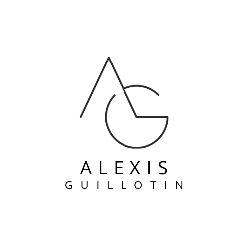
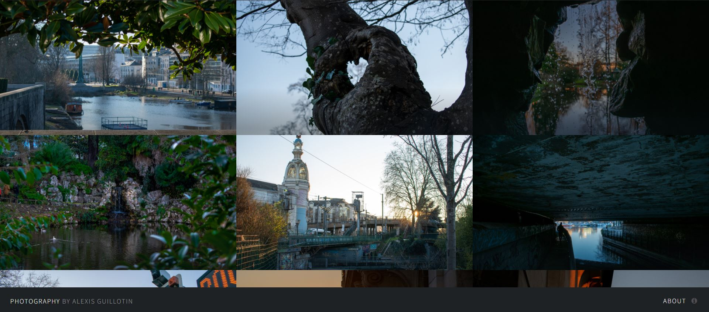

<!-- Improved compatibility of back to top link: See: https://github.com/othneildrew/Best-README-Template/pull/73 -->
<a name="readme-top"></a>

[![Contributors][contributors-shield]][contributors-url]
[![Forks][forks-shield]][forks-url]
[![Stargazers][stars-shield]][stars-url]
[![Issues][issues-shield]][issues-url]
[![MIT License][license-shield]][license-url]
[![LinkedIn][linkedin-shield]][linkedin-url]


<!-- PROJECT LOGO -->
<br />
<div align="center">
  <a href="https://github.com/alexisguillotin/photography">
    
  </a>

<h3 align="center">Photography website</h3>

  <p align="center">
    Website for personal branding, including photography section, online resume and much more to discover!
    <br />
    <a href="https://github.com/AlexisGuillotin/photography"><strong>Explore the docs »</strong></a>
    <br />
    <br />
    <a href="https://github.com/AlexisGuillotin/photography">View Demo</a>
    ·
    <a href="https://github.com/AlexisGuillotin/photography/issues">Report Bug</a>
    ·
    <a href="https://github.com/AlexisGuillotin/photography/issues">Request Feature</a>
  </p>
</div>


<!-- TABLE OF CONTENTS -->
## Table of content
- [Table of content](#table-of-content)
- [About The Project](#about-the-project)
  - [Built With](#built-with)
- [Getting Started](#getting-started)
  - [Prerequisites](#prerequisites)
  - [Dependancies](#dependancies)
- [Usage](#usage)
  - [Local testing](#local-testing)
  - [Upload your images](#upload-your-images)
- [Roadmap](#roadmap)
- [Contributing](#contributing)
- [Contact](#contact)
- [Sitography](#sitography)
- [Acknowledgments](#acknowledgments)


<!-- ABOUT THE PROJECT -->
## About The Project

Here below a **wonderful** preview of the home page ! 


<p align="right">(<a href="#readme-top">back to top</a>)</p>


### Built With

* CSS
* HTML
* JavaScript

<p align="right">(<a href="#readme-top">back to top</a>)</p>


<!-- GETTING STARTED -->
## Getting Started

Here some tips to use and understand the project.

### Prerequisites

If you just want to see the project, go to [https://alexisguillotin.github.io/photography/](https://alexisguillotin.github.io/photography/) and enjoy!
If you want to make your own project based on my repository, just hit the fork button on the repo!

### Dependancies
- bundle
- jekyll
- ImageMagick (in [bash_resize.sh](bash_resize.sh))


<!-- USAGE EXAMPLES -->
## Usage

Go to [https://alexisguillotin.github.io/photography/](https://alexisguillotin.github.io/photography/) and enjoy !

<p align="right">(<a href="#readme-top">back to top</a>)</p>

### Local testing
For easy & quick testing and edit, I have implemented a Jekyll dependancy.
You just have to run :
```bash
$ bundle install
```
To install all dependancies the first time, and then excecute:
```bash
$ bundle exec jekyll serve
```
After your site will be up at : http://localhost:4000


### Upload your images
Images are in [fulls](images/fulls/) and [thumbs](images/thumbs/). To upload them automatically you can use the [bash_resize.sh](bash_resize.sh) file.
Here how it's work :
1. Add all images in [images](images) folder.
2. launch a cmd and navigate to main directory of this project.
3. launch bash file with:
```bash
$ bash_resize.sh
```
All images will be properly resize in both subdirectory and removed from images folder !

<!-- ROADMAP -->
## Roadmap

- [X] Fork project from [https://github.com/rampatra/photography](https://github.com/rampatra/photography)
- [X] Resolve some issues and versions conflicts
- [X] Change way to upload images from gulp (not working) to bash script here : [bash_resize.sh](bash_resize.sh)
- [X] Add sidebar to navigate through more pages.
- [X] Add online resume.
- [X] Add Login form.
  - [ ] manage users with a database.
- [X] Add upload section.
  - [ ] manage uploaded images.
- [X] Add local testing method
- [ ] Check & make all pages responsive

See the [open issues](https://github.com/alexisguillotin/photography/issues) for a full list of proposed features (and known issues).

<p align="right">(<a href="#readme-top">back to top</a>)</p>


<!-- CONTRIBUTING -->
## Contributing

Contributions are what make the open source community such an amazing place to learn, inspire, and create. Any contributions you make are **greatly appreciated**.

If you have a suggestion that would make this better, please fork the repo and create a pull request. You can also simply open an issue with the tag "enhancement".
Don't forget to give the project a star! Thanks again!

1. Fork the Project
2. Create your Feature Branch (`git checkout -b feature/AmazingFeature`)
3. Commit your Changes (`git commit -m 'Add some AmazingFeature'`)
4. Push to the Branch (`git push origin feature/AmazingFeature`)
5. Open a Pull Request

<p align="right">(<a href="#readme-top">back to top</a>)</p>


<!-- CONTACT -->
## Contact

Alexis Guillotin - [alexis.guillotin@hotmail.com](alexis.guillotin@hotmail.com)

Project Link: [https://github.com/alexisguillotin/photography](https://github.com/alexisguillotin/photography)

<p align="right">(<a href="#readme-top">back to top</a>)</p>


## Sitography
- [Testing locally github pages](https://docs.github.com/fr/pages/setting-up-a-github-pages-site-with-jekyll/testing-your-github-pages-site-locally-with-jekyll)
- [ReadTheDocs documentation](https://docs.readthedocs.io/en/stable/)
- [RST documentation](https://sublime-and-sphinx-guide.readthedocs.io/)

<!-- ACKNOWLEDGMENTS -->
## Acknowledgments

* [https://github.com/rampatra](https://github.com/rampatra)

<p align="right">(<a href="#readme-top">back to top</a>)</p>


<!-- MARKDOWN LINKS & IMAGES -->
<!-- https://www.markdownguide.org/basic-syntax/#reference-style-links -->
[contributors-shield]: https://img.shields.io/github/contributors/alexisguillotin/photography.svg?style=for-the-badge
[contributors-url]: https://github.com/alexisguillotin/photography/graphs/contributors
[forks-shield]: https://img.shields.io/github/forks/alexisguillotin/photography.svg?style=for-the-badge
[forks-url]: https://github.com/alexisguillotin/photography/network/members
[stars-shield]: https://img.shields.io/github/stars/alexisguillotin/photography.svg?style=for-the-badge
[stars-url]: https://github.com/alexisguillotin/photography/stargazers
[issues-shield]: https://img.shields.io/github/issues/alexisguillotin/photography.svg?style=for-the-badge
[issues-url]: https://github.com/alexisguillotin/photography/issues
[license-shield]: https://img.shields.io/github/license/alexisguillotin/photography.svg?style=for-the-badge
[license-url]: https://github.com/alexisguillotin/photography/blob/master/LICENSE.txt
[linkedin-shield]: https://img.shields.io/badge/-LinkedIn-black.svg?style=for-the-badge&logo=linkedin&colorB=555
[linkedin-url]: https://linkedin.com/in/alexis-guillotin-50a8b8188
[product-screenshot]: images/screenshot.png
[Next.js]: https://img.shields.io/badge/next.js-000000?style=for-the-badge&logo=nextdotjs&logoColor=white
[Next-url]: https://nextjs.org/
[React.js]: https://img.shields.io/badge/React-20232A?style=for-the-badge&logo=react&logoColor=61DAFB
[React-url]: https://reactjs.org/
[Vue.js]: https://img.shields.io/badge/Vue.js-35495E?style=for-the-badge&logo=vuedotjs&logoColor=4FC08D
[Vue-url]: https://vuejs.org/
[Angular.io]: https://img.shields.io/badge/Angular-DD0031?style=for-the-badge&logo=angular&logoColor=white
[Angular-url]: https://angular.io/
[Svelte.dev]: https://img.shields.io/badge/Svelte-4A4A55?style=for-the-badge&logo=svelte&logoColor=FF3E00
[Svelte-url]: https://svelte.dev/
[Laravel.com]: https://img.shields.io/badge/Laravel-FF2D20?style=for-the-badge&logo=laravel&logoColor=white
[Laravel-url]: https://laravel.com
[Bootstrap.com]: https://img.shields.io/badge/Bootstrap-563D7C?style=for-the-badge&logo=bootstrap&logoColor=white
[Bootstrap-url]: https://getbootstrap.com
[JQuery.com]: https://img.shields.io/badge/jQuery-0769AD?style=for-the-badge&logo=jquery&logoColor=white
[JQuery-url]: https://jquery.com 

[css]: assets/images/CSS.png
[css-url]: https://www.w3.org/Style/CSS/

